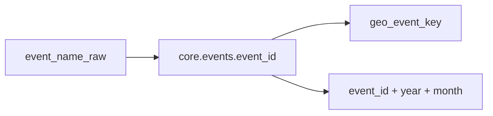

# Event identity model

WSDC data uses several overlapping identifiers. Use the right layer for each analytical question.

## Layers



| Layer | Key | Grain | Use when |
|-------|-----|-------|----------|
| **Registry** | `event_id` | One WSDC registry number | Join to `events_wsdc`, official URL, historical API id |
| **Edition** | `(event_id, event_year, event_month)` | One held event in a calendar month | Result rows, `event_editions`, attendance stats |
| **Geo-event** | `geo_event_key` = normalized name + `geo_key` | One brand in one geography | Same marketing name in Dallas vs Orlando = **two** geo-events |
| **Raw title** | `event_name_raw` | As printed on result row | Audit renames, alias seeding |

## Registry (`event_id`)

- Source: WSDC points registry (`events_wsdc.csv` → `core.events`)
- Stable integer assigned by WSDC
- **Problem:** WSDC sometimes assigns two ids to the same brand in the same city (duplicate registry entries)
- **Fix:** merge only when [geo policy](../policies/event-geo-dedup.md) passes (`MERGE_EVENT_ID_MAP` in `transform/knowledge/event_aliases.py`)

**Do not rename** `core.events.name` for marketing rebrands — use `core.event_aliases` and preserve `event_name_raw` on results.

## Edition

- Built in `core.event_editions` after each load (`db/build_event_catalog.py`)
- Unique constraint: `(event_id, event_year, event_month)`
- Join results to editions (legacy CSV has **no `event_id`**):

```text
dancers_results_info.event_name = event_editions.event_name
  AND event_year / event_month match on both sides
```

Better: use `event_editions.event_id` from catalog after matching `event_name` to `event_catalog.canonical_name`, or export `results_by_event.csv` which includes `event_id` and `edition_id`.

Requires preprocess to populate ISO `event_year` / `event_month` (cloud parse writes `"January 1997"` strings without preprocess).

## Geo-event (`geo_event_key`)

Defined in `transform/geography/geo_event.py` and `export.geo_events` (migration 019).

- `geo_key(city, state, country)` — normalized location fingerprint
- **Metro clusters:** Boston + Framingham, MA → `metro:greater_boston_ma` (one geo for merge)
- **Keep separate** (hardcoded): Worlds UCWDC 75/152, Sunny Side 191/230, Spring Swing 83/204

Export views:

- `export.geo_events` — one row per registry id with geo metadata
- `export.results_by_geo_event` — denormalized results (optional; not in default CSV export)

Enable CSV export locally:

```bash
# Add to export.py EVENT_CATALOG_EXPORTS or query view directly
python export.py --include-results-by-event  # different file; geo export is manual today
```

## Schedule vs points catalog

Two naming systems:

| System | Source | Name field |
|--------|--------|------------|
| Points / results | points.worldsdc.com API | `core.events.name`, `event_name_raw` |
| Upcoming schedule | worldsdc.com/events/ scrape | `events_list_current.event_name` |

Link via `canonical_event_id` on `core.events_list_current` after mapping (`parser/event_name_matcher.py`). See [policies/event-rename-aliases.md](../policies/event-rename-aliases.md).

## Dancer identity

| Layer | Key | Grain | Use when |
|-------|-----|-------|----------|
| **Registry** | `dancer_id` | One WSDC dancer | All joins — stable across renames |
| **Current name** | `core.dancers.dancer_name` | Latest display name | Current dashboards, `dancer_role_info.csv` |
| **Name history** | `history.dancer_names_history` | `[valid_from, valid_to]` per name version | Rename audit, point-in-time labels |
| **Alias** | `core.dancer_aliases.alias` | Alternate string → id | Maiden names, typos (knowledge map) |

**Do not** treat `changed_dancer_role_info.csv` as name history — it records **division** changes only (migration 021). Use `changed_dancer_name_info.csv` or `core.dancer_name_at()`.

Competitive role/division history remains in `history.dancer_roles_history` with signature `core.dancer_roles_division_sig(...)`.

## Tableau guidance

| Question | Primary dimension |
|----------|-------------------|
| Historical results by official registry | `event_id` + `event_catalog` |
| Dancer name on past result row | `changed_dancer_name_info` or `dancers_results_with_name.csv` |
| Current dancer display name | `dancer_role_info.dancer_name` |
| Results by city / country | `location_info` or `event_editions.place_*` |
| Same name, different cities | `geo_event_key` or join `export.geo_events` |
| Upcoming events on WSDC site | `scheduled_events.csv` |

See [../tableau/joins.md](../tableau/joins.md).
