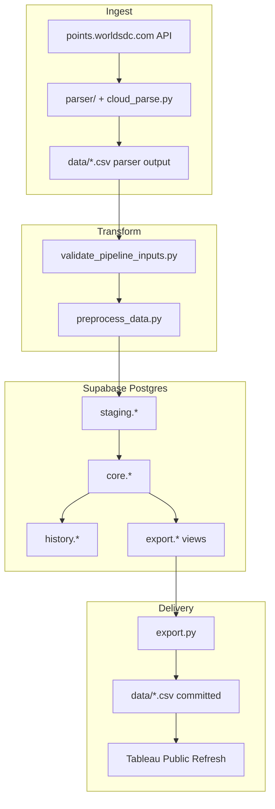

# Pipeline overview

End-to-end flow from WSDC points API to Tableau Public CSV files.

## Data flow



## Stages

### 1. Parse

| Entry point | When |
|-------------|------|
| `python -m parser.wsdc_parser` | Local full parse |
| `scripts/cloud_parse.py --full` | GitHub Actions (all dancer IDs 1..live_max) |
| Committed `data/*.csv` | Skip parse; load from repo |

**Output:** parser CSVs matching the legacy laptop format (`dancer_role_info`, `dancers_points_info`, `dancers_results_info`, `location_info`, `events_wsdc`).

### 2. Preprocess

`scripts/preprocess_data.py` runs `transform/preprocess_with_log.py`:

- Normalize roles, divisions, event names, dates, locations
- Write `data/quality_reports/latest.json` (before / applied / manual review)
- Overwrite CSVs in `--data-dir` with cleaned values

Always run preprocess before load when CSVs come from cloud parse (API dates are `"Month Year"` strings).

### 3. Load

`load.py` (or `scripts/run_pipeline.py`):

```
load_staging_from_dir
  → INSERT history.parse_runs (status=running)
  → record_weekly_points_history.sql
  → record_weekly_roles_history.sql
  → promote_core.sql
  → prepare_event_resolution (event_aliases seed)
  → promote_core_results.sql
  → enrich_core_known_events
  → rebuild_event_catalog
  → ANALYZE
  → UPDATE parse_runs (success)
```

Staging tables are truncated and reloaded each run. Core points/roles are full snapshots; results are merged via promote SQL.

### 4. Export

`export.py` copies `export.*` views to `data/*.csv` via Postgres `COPY`. Default export includes legacy 5 + event catalog 3 + history 2 (10 files).

### 5. CI automation

| Workflow | Role |
|----------|------|
| `check-updates.yml` | Probe new dancer IDs; trigger full-parse when gate passes |
| `full-parse.yml` | Parse (optional) → migrations → preprocess → load → export → commit CSV |
| `sync-events-list.yml` | Tuesday scrape of worldsdc.com/events/ |

See [operations/github-actions.md](../operations/github-actions.md).

## Repository layout

| Path | Role |
|------|------|
| `parser/` | HTTP API client, Selenium fallback |
| `transform/` | Preprocess, geography, knowledge maps, quality audit |
| `db/migrations/` | Schema DDL (staging, core, history, export) |
| `db/sql/` | Load-time SQL (promote, weekly history) |
| `scripts/` | Pipeline orchestration, sync, repair, monitoring |
| `data/` | Committed export CSVs + quality reports |
| `export.py` | View → CSV exporter |

## Orchestration shortcut

```bash
python scripts/run_pipeline.py --data-dir ./data --source local
python scripts/run_pipeline.py --export-only
```

Flags: `--skip-migrations` to skip `db/apply.py`.

## Related docs

- [identity-model.md](identity-model.md) — How events are identified across layers
- [scd2-history.md](scd2-history.md) — Change history semantics
- [../database/index.md](../database/index.md) — Schema reference
- [../operations/pipeline-runbook.md](../operations/pipeline-runbook.md) — Manual runs
