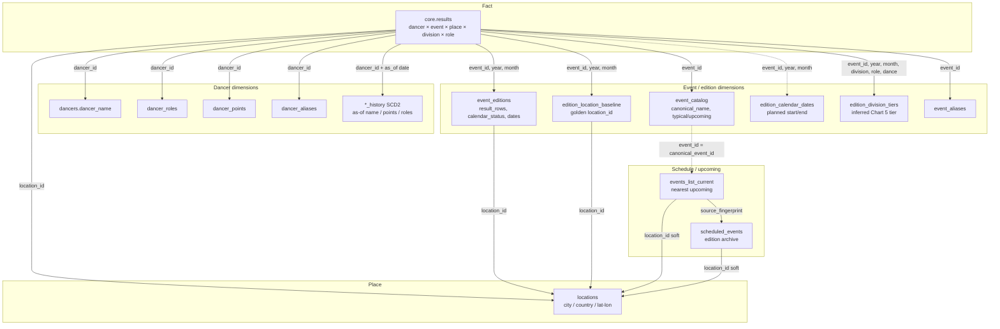
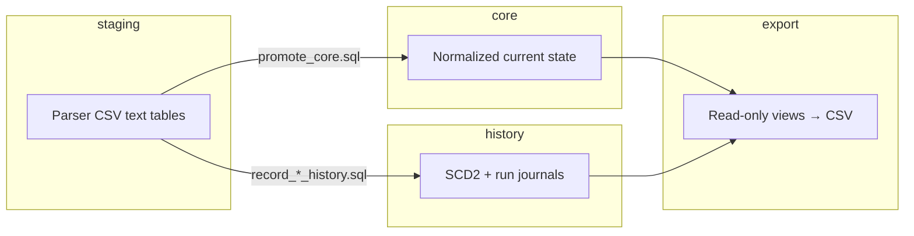
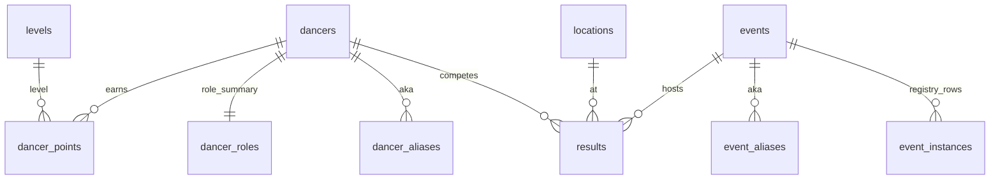
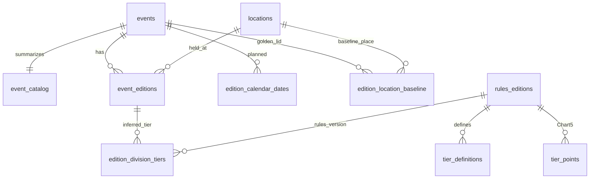
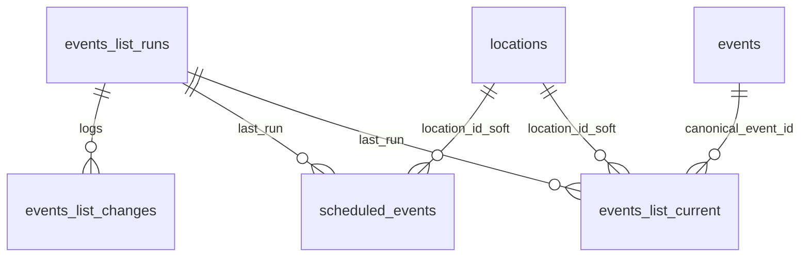
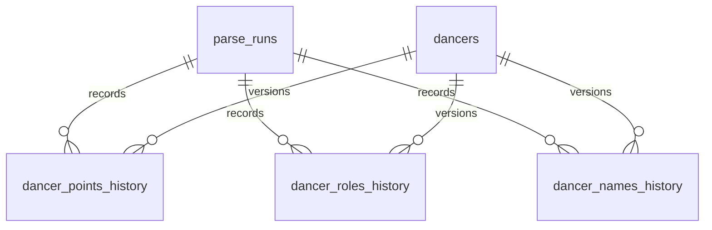
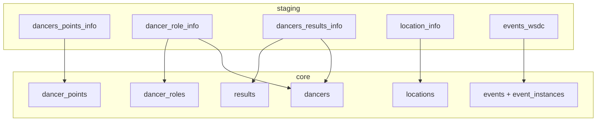

# Entity-relationship diagrams

Current Supabase warehouse as of migrations **001–034**. Source of truth: `db/migrations/*.sql`.

!!! tip "Interactive ERD (pan / zoom)"
    Open the **fullscreen model explorer** — scroll to zoom, drag to pan, Fit / Reset controls:

    **[→ Open interactive ERD explorer](../assets/erd-explorer.html){ target=_blank }**

    Same model as below, in a DBeaver-style canvas. Also download [`wsdc_warehouse.dbml`](../assets/wsdc_warehouse.dbml) and paste into [dbdiagram.io](https://dbdiagram.io/d) for another pan/zoom editor.

!!! info "Live schema in DBeaver"
    Connect to Supabase (same creds as `.env`) → expand schemas `core` / `history` → select tables → right-click → **View diagram** / ERD. That is the closest UX to a desktop model editor with live columns.

**Solid lines** = physical FK. **Soft links** (dashed in the enrichment map) = join keys without FK — schedule / calendar must survive points-load `TRUNCATE … CASCADE` (migrations 025, 031).

---

## Full warehouse map

One diagram of **all core + history tables** and how they connect. For pan/zoom use the [interactive explorer](../assets/erd-explorer.html). Static version:

```mermaid
erDiagram
  %% ===== hubs =====
  dancers ||--o{ results : "dancer_id"
  events ||--o{ results : "event_id"
  locations ||--o{ results : "location_id"

  dancers ||--|| dancer_roles : "dancer_id"
  dancers ||--o{ dancer_points : "dancer_id"
  dancers ||--o{ dancer_aliases : "dancer_id"
  levels ||--o{ dancer_points : "level"

  events ||--o{ event_aliases : "event_id"
  events ||--o{ event_instances : "event_id"
  locations ||--o{ event_instances : "location_id"
  events ||--|| event_catalog : "event_id"

  events ||--o{ event_editions : "event_id"
  locations ||--o{ event_editions : "location_id"

  events ||--o{ edition_location_baseline : "event_id"
  locations ||--o{ edition_location_baseline : "location_id"

  events ||--o{ edition_calendar_dates : "event_id soft"
  event_editions ||--o{ edition_division_tiers : "edition key"
  rules_editions ||--o{ tier_definitions : "rules_version"
  rules_editions ||--o{ tier_points : "rules_version"
  rules_editions ||--o{ edition_division_tiers : "rules_version"

  events ||--o{ events_list_current : "canonical_event_id soft"
  locations ||--o{ events_list_current : "location_id soft"
  locations ||--o{ scheduled_events : "location_id soft"
  events_list_runs ||--o{ events_list_current : "last_run_id"
  events_list_runs ||--o{ scheduled_events : "last_run_id"
  events_list_runs ||--o{ events_list_changes : "run_id"

  parse_runs ||--o{ dancer_points_history : "run_id"
  parse_runs ||--o{ dancer_roles_history : "run_id"
  parse_runs ||--o{ dancer_names_history : "run_id"
  dancers ||--o{ dancer_points_history : "dancer_id"
  dancers ||--o{ dancer_roles_history : "dancer_id"
  dancers ||--o{ dancer_names_history : "dancer_id"

  %% ===== key columns (compact) =====
  dancers {
    int dancer_id PK
    text dancer_name
  }
  dancer_aliases {
    text alias PK
    int dancer_id FK
  }
  dancer_roles {
    int dancer_id PK_FK
  }
  dancer_points {
    int dancer_id PK_FK
    text role PK
    text dance PK
    text level PK_FK
  }
  levels {
    text level PK
  }
  locations {
    int location_id PK
    text event_city
    text event_country
  }
  events {
    int event_id PK
    text name
  }
  event_aliases {
    text alias PK
    int event_id FK
  }
  event_instances {
    int event_instance_id PK
    int event_id FK
    int location_id FK
  }
  event_catalog {
    int event_id PK_FK
    text canonical_name
    text typical_location
    text upcoming_location
  }
  results {
    bigint result_id PK
    int dancer_id FK
    int event_id FK
    int location_id FK
    int event_year
    int event_month
    text division
    text role
  }
  event_editions {
    bigint edition_id PK
    int event_id FK
    int event_year UK
    int event_month UK
    int location_id FK
    int result_rows
  }
  edition_location_baseline {
    int event_id PK_FK
    int event_year PK
    int event_month PK
    int location_id FK
    text source
  }
  edition_calendar_dates {
    int event_id PK
    int event_year PK
    int event_month PK
    date planned_start_date
    text calendar_status
  }
  edition_division_tiers {
    int event_id PK
    int event_year PK
    int event_month PK
    text division PK
    text role PK
    text dance PK
    int tier
  }
  rules_editions {
    text rules_version PK
  }
  tier_definitions {
    text rules_version PK_FK
    int tier PK
  }
  tier_points {
    text rules_version PK_FK
    int tier PK
    int placement PK
  }
  scheduled_events {
    text source_fingerprint PK
    text event_name
    int location_id
    int last_run_id FK
  }
  events_list_current {
    text schedule_event_key PK
    int canonical_event_id
    int location_id
    int last_run_id FK
  }
  events_list_runs {
    int run_id PK
  }
  events_list_changes {
    int change_id PK
    int run_id FK
  }
  parse_runs {
    bigint run_id PK
  }
  dancer_points_history {
    int dancer_id PK
    date valid_from PK
    date valid_to
    bigint run_id FK
  }
  dancer_roles_history {
    int dancer_id PK
    date valid_from PK
    bigint run_id FK
  }
  dancer_names_history {
    int dancer_id PK
    date valid_from PK
    bigint run_id FK
  }
```

### Hub keys (remember these three)

| Hub | Key | Almost everything joins through |
|-----|-----|----------------------------------|
| **Dancer** | `dancer_id` | results, points, roles, aliases, SCD2 history |
| **Event (brand)** | `event_id` | results, catalog, editions, aliases, baseline, schedule match |
| **Place** | `location_id` | results, editions, baseline, schedule geo |

**Edition grain** (fourth join key, composite):  
`(event_id, event_year, event_month)` — links `results` ↔ `event_editions` ↔ `edition_location_baseline` ↔ `edition_calendar_dates` ↔ `edition_division_tiers`.

---

## Enrichment map (how to join for analytics)

Start from a **fact** row and pull dimensions. Dashed = soft join (no FK).



### Recipe table — common enrichments

| I have… | I want… | Join |
|---------|---------|------|
| `results` | Dancer display name (current) | `dancers` ON `dancer_id` |
| `results` | Name **as of** competition date | `dancer_name_at(dancer_id, event_date)` or `export.dancers_results_with_name` |
| `results` | City / country / coords | `locations` ON `location_id` |
| `results` | Catalog title + typical place | `event_catalog` ON `event_id` |
| `results` | Edition stats / calendar status | `event_editions` ON `(event_id, event_year, event_month)` |
| `results` | Planned calendar dates | `edition_calendar_dates` ON same edition key *(soft)* |
| `results` / `event_editions` | Golden place vs current | `edition_location_baseline` ON edition key; compare `location_id` |
| `results` | Inferred Tier / competitor band | `edition_division_tiers` ON edition key + `division` + `role` + `dance` |
| `event_id` | Upcoming edition on WSDC list | `events_list_current` ON `canonical_event_id = event_id` *(soft)* |
| `events_list_current` | Geo for map pin | `locations` ON `location_id` *(soft)* |
| `event_name` string | Stable `event_id` | `event_aliases` / `events.name` |
| `dancer_id` | Current points ladder | `dancer_points` ON `dancer_id` (+ role/dance/level) |
| Any SCD2 question | Version at date | `*_history` WHERE `valid_from ≤ d` AND (`valid_to` IS NULL OR `valid_to > d`) |

### SQL sketch (results → enriched edition)

```sql
SELECT
    r.result_id,
    r.dancer_id,
    d.dancer_name,
    r.event_id,
    c.canonical_name,
    r.event_year,
    r.event_month,
    r.location_id          AS results_location_id,
    l.event_city,
    l.event_country,
    b.location_id          AS baseline_location_id,
    ed.calendar_status,
    ed.start_date,
    edt.tier,
    edt.status             AS tier_status
FROM core.results r
JOIN core.dancers d
  ON d.dancer_id = r.dancer_id
LEFT JOIN core.event_catalog c
  ON c.event_id = r.event_id
LEFT JOIN core.locations l
  ON l.location_id = r.location_id
LEFT JOIN core.event_editions ed
  ON ed.event_id = r.event_id
 AND ed.event_year = r.event_year
 AND ed.event_month = r.event_month
LEFT JOIN core.edition_location_baseline b
  ON b.event_id = r.event_id
 AND b.event_year = r.event_year
 AND b.event_month = r.event_month
LEFT JOIN core.edition_division_tiers edt
  ON edt.event_id = r.event_id
 AND edt.event_year = r.event_year
 AND edt.event_month = r.event_month
 AND edt.division = r.division
 AND edt.role = r.role
 AND edt.dance = r.dance;
```

Ready-made denormalized views (when you prefer not to hand-join):  
`export.results_by_event`, `export.completed_event_editions`, `export.geo_events` / `results_by_geo_event` — see [export-views.md](export-views.md).

---

## Schema layers



| Schema | Mutability | Truncated by points load? |
|--------|------------|---------------------------|
| `staging` | Reload each load | Yes (full replace) |
| `core` (points tables) | Refresh each load | Yes (`TRUNCATE` dancers/results/…) |
| `core` (schedule / calendar / baseline / tiers) | Upsert / rebuild | **No** |
| `history` | Append / close intervals | No |
| `export` | Views only | N/A |

---

## Soft vs hard FK (important for enrichment)

| Relationship | Physical FK? | Join anyway? |
|--------------|--------------|--------------|
| `results` → dancers / events / locations | Yes | Yes |
| `event_editions` → events / locations | Yes | Yes |
| `edition_location_baseline` → events / locations | Yes | Yes |
| `edition_calendar_dates` → events | **No** (025) | Yes on `(event_id, year, month)` |
| `events_list_current.canonical_event_id` → events | **No** | Yes when matched |
| `scheduled_events` / `events_list_current` → locations | **No** (031) | Yes when `location_id` set |
| `edition_division_tiers` → editions | Logical only | Yes on edition key |

---

## Domain zooms (optional detail)

Same warehouse, smaller slices — use when the full map is too dense.

### Points & results



### Catalog, editions, baseline, tiers



### Schedule



### History / SCD2



### Staging → core promote



---

## Related docs

- [Schema overview](index.md)
- [Core tables](core.md) — column catalogs
- [Export views](export-views.md) — ready-made denormalized surfaces
- [Event identity](../architecture/identity-model.md)
- [Geography](../transform/geography.md) — how `location_id` is minted / corrected
