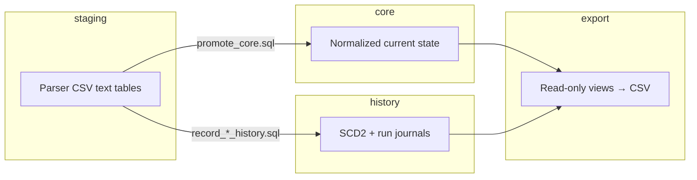
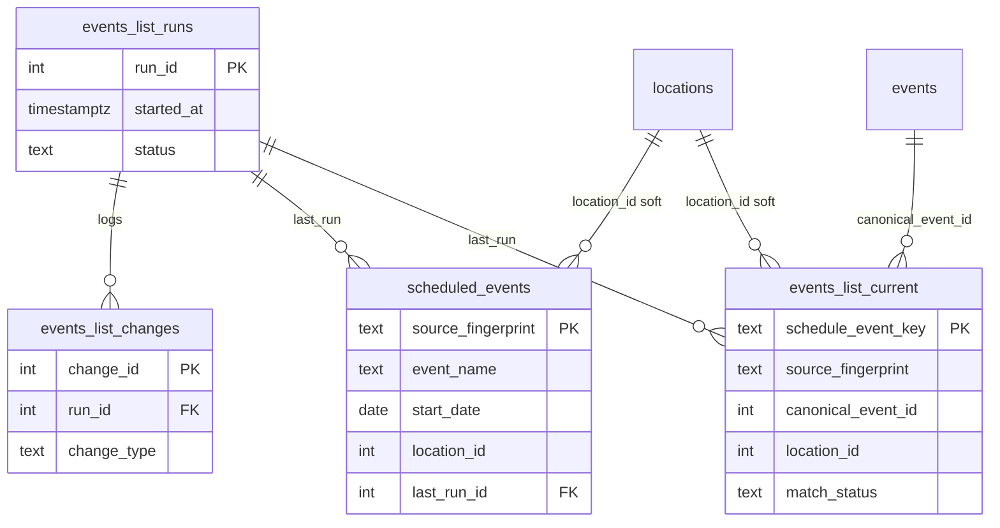
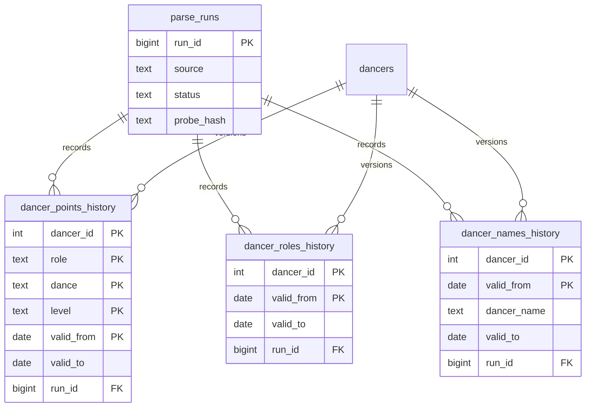
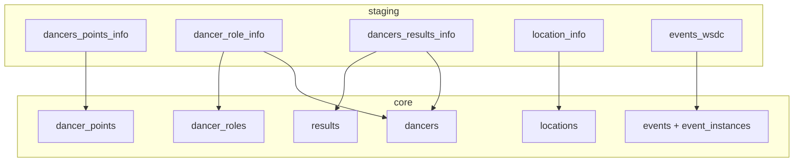
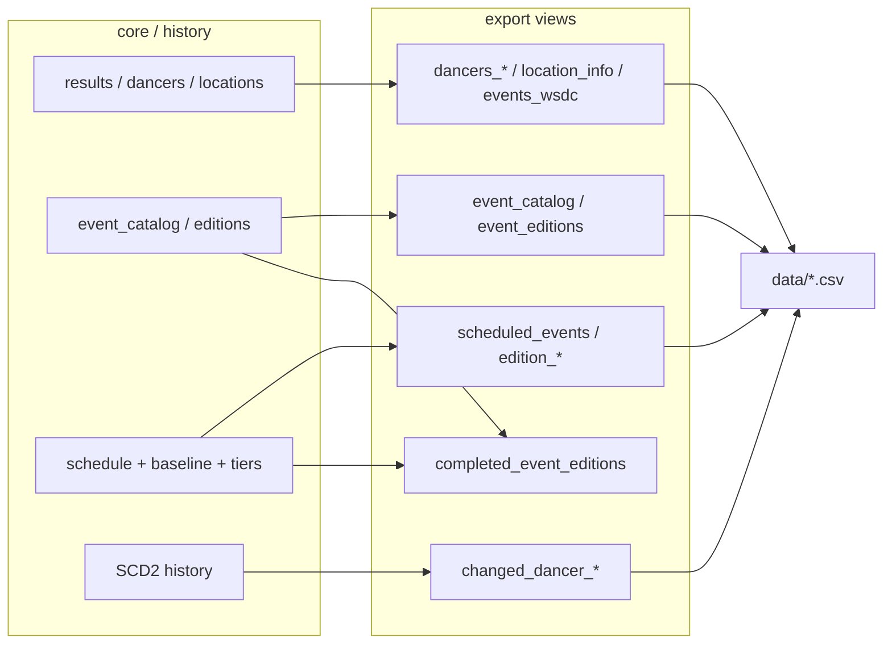

# Entity-relationship diagrams

Current Supabase warehouse as of migrations **001–034**. Source of truth: `db/migrations/*.sql`.

These diagrams show **logical FKs and grains**. Some schedule tables intentionally omit physical FKs to `core.locations` / `core.events` so points-load `TRUNCATE … CASCADE` cannot wipe them (migrations 025, 031).

## Warehouse schemas



| Schema | Mutability | Truncated by points load? |
|--------|------------|---------------------------|
| `staging` | Reload each load | Yes (full replace) |
| `core` (points tables) | Refresh each load | Yes (`TRUNCATE` dancers/results/…) |
| `core` (schedule / calendar / baseline / tiers) | Upsert / rebuild | **No** |
| `history` | Append / close intervals | No |
| `export` | Views only | N/A |

---

## 1. Points & results (core)

Grain of the points pipeline: dancers compete at event editions held at locations.

```mermaid
erDiagram
  levels ||--o{ dancer_points : "level"
  dancers ||--o{ dancer_points : earns
  dancers ||--|| dancer_roles : "role summary"
  dancers ||--o{ dancer_aliases : "aka"
  dancers ||--o{ results : competes
  events ||--o{ results : hosts
  locations ||--o{ results : at
  events ||--o{ event_aliases : "aka"
  events ||--o{ event_instances : "registry rows"

  dancers {
    int dancer_id PK
    text dancer_name
  }
  dancer_aliases {
    text alias PK
    int dancer_id FK
  }
  levels {
    text level PK
    text level_abbr
    int sort_order
  }
  dancer_points {
    int dancer_id PK_FK
    text role PK
    text dance PK
    text level PK_FK
    int total_points
  }
  dancer_roles {
    int dancer_id PK_FK
    text dominate_role
  }
  locations {
    int location_id PK
    text event_city
    text event_country
  }
  events {
    int event_id PK
    text name
  }
  event_aliases {
    text alias PK
    int event_id FK
  }
  event_instances {
    int event_instance_id PK
    int event_id FK
    int location_id FK
  }
  results {
    bigint result_id PK
    int dancer_id FK
    int event_id FK
    int location_id FK
    int event_year
    int event_month
    text event_name_raw
  }
```

**Edition join (logical, not a single FK):**  
`results.(event_id, event_year, event_month)` ↔ `event_editions.(event_id, event_year, event_month)`.

---

## 2. Catalog, editions, calendar, location baseline

Brand-level catalog plus per-edition facts. Calendar dates and location baseline **survive** points `TRUNCATE`.

```mermaid
erDiagram
  events ||--|| event_catalog : summarizes
  events ||--o{ event_editions : has
  locations ||--o{ event_editions : "held_at"
  events ||--o{ edition_calendar_dates : "planned dates"
  events ||--o{ edition_location_baseline : "golden lid"
  locations ||--o{ edition_location_baseline : "baseline place"
  event_editions ||--o{ edition_division_tiers : "inferred tier"
  rules_editions ||--o{ tier_definitions : defines
  rules_editions ||--o{ tier_points : "Chart 5"
  rules_editions ||--o{ edition_division_tiers : "rules_version"

  event_catalog {
    int event_id PK_FK
    text canonical_name
    text typical_location
    text upcoming_location
  }
  event_editions {
    bigint edition_id PK
    int event_id FK
    int event_year UK
    int event_month UK
    int location_id FK
    int result_rows
    text calendar_status
  }
  edition_calendar_dates {
    int event_id PK
    int event_year PK
    int event_month PK
    date planned_start_date
    text calendar_status
    text date_source
  }
  edition_location_baseline {
    int event_id PK_FK
    int event_year PK
    int event_month PK
    int location_id FK
    text source
  }
  edition_division_tiers {
    int event_id PK
    int event_year PK
    int event_month PK
    text division PK
    text role PK
    text dance PK
    int tier
    text status
  }
  rules_editions {
    text rules_version PK
    date valid_from
    date valid_to
  }
  tier_definitions {
    text rules_version PK_FK
    int tier PK
    int min_competitors
    int max_competitors
  }
  tier_points {
    text rules_version PK_FK
    int tier PK
    int placement PK
    int points
  }
```

| Table | Physical FK to `events` / `locations`? | Why it matters |
|-------|----------------------------------------|----------------|
| `event_editions` | Yes | Rebuilt after each load from results + calendar |
| `edition_calendar_dates` | **No** FK to events | Survives `TRUNCATE … CASCADE` on events (025) |
| `edition_location_baseline` | Yes | Drift detection + auto-extend after load (033) |
| `edition_division_tiers` | Logical only | Rebuilt by `build_edition_tiers.py` |

---

## 3. Schedule domain (events list)

Independent of points load. Updated by `scripts/sync_events_list.py` / calendar sync.



`location_id` on schedule tables is a **soft reference** (no FK) — migration 031.

---

## 4. History / SCD2



Open version = `valid_to IS NULL`. See [SCD2 history](../architecture/scd2-history.md).

---

## 5. Staging → core promote

Staging is all-text and 1:1 with parser CSVs. Promote casts and resolves FKs.



Changed-dancer staging tables (`staging.changed_*`) feed SCD2 recording, not the full snapshot replace.

---

## 6. Export surface (Tableau)

Default CSVs come from `export.*` views via `export.py`. Full map: [export-views.md](export-views.md).



| View | In default `export.py`? | Notes |
|------|-------------------------|-------|
| `export.completed_event_editions` | No | Live VIEW (034); query in Supabase / analytics |
| `export.geo_events` / `results_by_geo_event` | No | Optional analytics |
| `export.scheduled_event_editions` | No | Full schedule archive grain |
| `export.results_by_event` | Opt-in flag | Large |

---

## Related docs

- [Schema overview](index.md)
- [Core tables](core.md)
- [Staging](staging.md)
- [History](history.md)
- [Export views](export-views.md)
- [Event identity](../architecture/identity-model.md)
- [Geography transform](../transform/geography.md) — `location_id` minting / merge-map retirement
