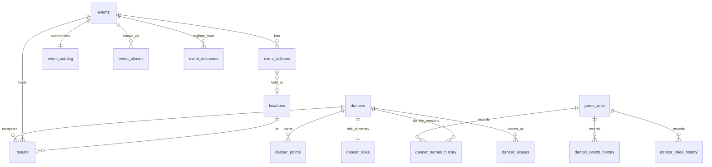
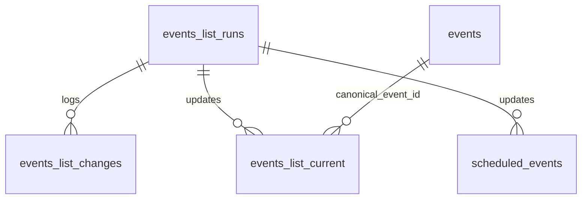

# Database overview

Supabase Postgres hosts four logical schemas plus migration tracking.

## Schemas

| Schema | Purpose | Mutability |
|--------|---------|------------|
| `staging` | Parser CSV landing (all text columns) | Truncated each load |
| `core` | Normalized current state | Refreshed each load; catalog rebuilt |
| `history` | SCD2 change log + run journal | Append / close intervals |
| `export` | Read-only views for Tableau CSV export | Defined in migrations |
| `public.schema_migrations` | Applied migration filenames | One row per migration |

## Core entity relationships

## Schedule domain (independent from points load)

Points load (`promote_core.sql`) does **not** truncate schedule tables.

## Documentation index

| Doc | Contents |
|-----|----------|
| [staging.md](staging.md) | `staging.*` tables |
| [core.md](core.md) | `core.*` tables |
| [history.md](history.md) | `history.*` tables |
| [export-views.md](export-views.md) | `export.*` views |
| [migrations.md](migrations.md) | Migration list and apply workflow |

## Connection

Local: `.env` with `DATABASE_URL` or `DB_HOST` / `DB_USER` / `DB_PASSWORD`.

GitHub Actions: Supabase **transaction pooler** (IPv4) — see [../operations/github-actions.md](../operations/github-actions.md).

## Field catalog convention

Each table doc lists:

- **Grain** — what one row represents
- **Keys** — PK, unique, FK
- **Columns** — name, type, nullable, description

Generated fragments (optional refresh): `docs/database/_generated/` via `scripts/generate_schema_docs.py`.
