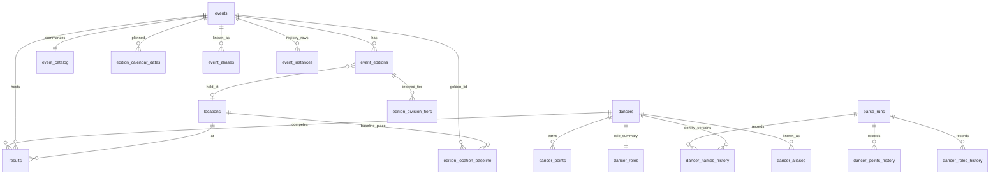
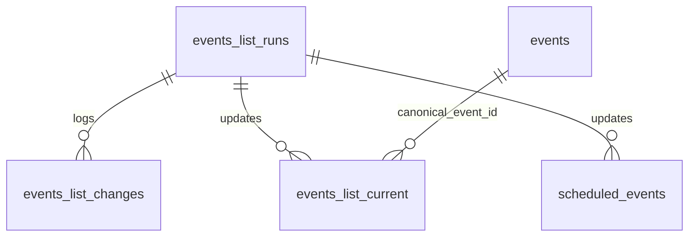

# Database overview

Supabase Postgres hosts four logical schemas plus migration tracking.

## Schemas

| Schema | Purpose | Mutability |
|--------|---------|------------|
| `staging` | Parser CSV landing (all text columns) | Truncated each load |
| `core` | Normalized current state | Points tables refreshed each load; catalog / schedule / baseline / tiers rebuilt or upserted |
| `history` | SCD2 change log + run journal | Append / close intervals |
| `export` | Read-only views for Tableau CSV export | Defined in migrations |
| `public.schema_migrations` | Applied migration filenames | One row per migration |

## ER diagrams

Full domain diagrams (points, catalog/baseline/tiers, schedule, history, staging→core, export):

→ **[Entity-relationship diagrams](erd.md)**

### Core entity relationships (summary)

```mermaid
erDiagram
  dancers ||--o{ results : competes
  events ||--o{ results : hosts
  locations ||--o{ results : at
  events ||--o{ event_editions : has
  events ||--|| event_catalog : summarizes
  event_editions }o--o| locations : held_at
  events ||--o{ edition_location_baseline : golden_lid
  locations ||--o{ edition_location_baseline : baseline_place
  events ||--o{ edition_calendar_dates : planned
  event_editions ||--o{ edition_division_tiers : inferred_tier
  dancers ||--o{ dancer_points : earns
  dancers ||--|| dancer_roles : role_summary
  events ||--o{ event_aliases : known_as
  events ||--o{ event_instances : registry_rows
  parse_runs ||--o{ dancer_points_history : records
  parse_runs ||--o{ dancer_roles_history : records
  parse_runs ||--o{ dancer_names_history : records
  dancers ||--o{ dancer_names_history : identity_versions
  dancers ||--o{ dancer_aliases : known_as
```

### Schedule domain (independent from points load)

```mermaid
erDiagram
  events_list_runs ||--o{ events_list_changes : logs
  events_list_runs ||--o{ events_list_current : updates
  events_list_runs ||--o{ scheduled_events : updates
  events ||--o{ events_list_current : canonical_event_id
```

Points load (`promote_core.sql`) does **not** truncate schedule tables, `edition_calendar_dates`, `edition_location_baseline`, or tier reference tables.

## Documentation index

| Doc | Contents |
|-----|----------|
| [erd.md](erd.md) | Mermaid ERDs for the current warehouse |
| [staging.md](staging.md) | `staging.*` tables |
| [core.md](core.md) | `core.*` tables |
| [history.md](history.md) | `history.*` tables |
| [export-views.md](export-views.md) | `export.*` views |
| [migrations.md](migrations.md) | Migration list and apply workflow |
| [_generated/](_generated/tables.md) | Auto-generated column lists |

## Connection

Local: `.env` with `DATABASE_URL` or `DB_HOST` / `DB_USER` / `DB_PASSWORD`.

GitHub Actions: Supabase **transaction pooler** (IPv4) — see [../operations/github-actions.md](../operations/github-actions.md).

## Field catalog convention

Each table doc lists:

- **Grain** — what one row represents
- **Keys** — PK, unique, FK
- **Columns** — name, type, nullable, description

Generated fragments (optional refresh): `docs/database/_generated/` via `scripts/generate_schema_docs.py` / `scripts/sync_docs.py`.
