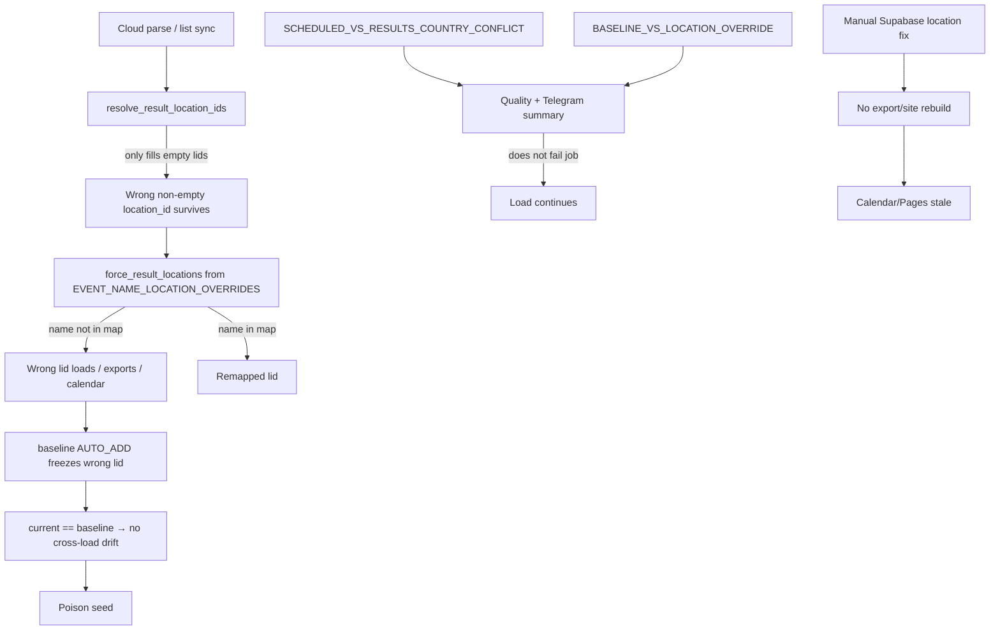

# System fragility audit (locations, automation, calendar sync)

**Date:** 2026-08-26  
**Scope:** `wsdc-data-pipeline`, analytics site (`wsdc-analytics.github.io`), Telegram notify + bot CSV sync, Point Summary / Champion News touchpoints.  
**Wave:** read-only findings + ranked fix backlog. **No production code changes in this wave.**

Policy locked in planning (grill-me):

| Topic | Decision |
|--------|----------|
| Dominant bug | Shared wrong `location_id` (foreign city sticks to a series) |
| Truth model | Stable event↔location is normal; **cross-country on same `event_id` = error** (or new id, Sunny Side pattern); same-country city move = rare/manual |
| On country mismatch | **Do not block load**; loud Telegram alert with event + old/new location |
| Autonomy target | Hands-off except allowlist alerts |
| Dual-write shape | Every successful **full-parse** and **events-list sync** rebuilds calendar/site; plus a dedicated **force rebuild** workflow for manual DB repairs |

---

## 1. Inventory — auto vs manual today

### Surfaces

| Surface | Repo / path | Auto today? |
|---------|-------------|-------------|
| Probe WSDC API | `.github/workflows/check-updates.yml` | Yes (cron Mon–Fri) |
| Full parse → load → export | `.github/workflows/full-parse.yml` | Yes when gate opens / dispatch |
| Weekly events list + calendar scrape | `.github/workflows/sync-events-list.yml` | Yes (Tue) |
| Location overrides force-remap | `transform/knowledge/apply.py` + `events.py` | Yes on preprocess; re-applied on `export.py` |
| Edition location baseline | `db/edition_location_baseline.py` via `load.py` | Yes (drift report + auto-add) |
| Preprocess / Supabase quality | `transform/quality_audit.py`, `db/quality_checks.py` | Yes; alerts in Telegram |
| Analytics site JSON | `scripts/sync_analytics_site.sh` | Yes after full-parse; after list sync **only if CSV commit** |
| Year Event Calendar | `scripts/build_year_event_calendar.py` | Yes inside site sync (**warn-on-fail**) |
| Point Summary / Champion News site JSON | builders in site sync | Yes (**warn-on-fail**) |
| Telegram pipeline notify | `scripts/telegram_notify.py` | Yes (check / parse-start / complete / fail) |
| Bot weekend / CSV consume | `zlat1109/wsdc-telegram-bot` via `pipeline-csv-updated` | Yes if `WSDC_BOT_SYNC_TOKEN` set |
| ChampNews Telegram RU posts | external `telegram-news-bot` editorial | **Manual** |
| Tableau Public refresh | local Desktop | **Manual** |
| SCD2 reconcile | `scripts/reconcile_*_history.py` | **Manual** when drift > 0 |
| Zombie `parse_runs` | `scripts/close_parse_runs.py` | **Manual** |
| Legitimate venue baseline update | Supabase `UPDATE … source='manual'` | **Manual** |
| Force calendar/site after DB-only location repair | — | **Missing** (gap) |

### Happy path (automated)

```text
check-updates (probe)
  → full-parse (cloud_parse → preprocess → load → export)
  → commit data/*.csv on main
  → dispatch bot CSV sync
  → sync_analytics_site.sh (KPIs, secondary, PS, CN, year calendar, L2 cards)
  → Telegram #WSDC_Pipeline_Complete (+ ⚠️ attention block if needed)
```

Weekly list sync is a parallel Tuesday path (list+calendar scrape → export → optional site sync).

---

## 2. Location failure tree



### Mechanisms (file evidence)

| Failure | Why | Where |
|---------|-----|--------|
| Shared wrong lid | `resolve_result_location_ids` fills **empty** ids only; non-empty wrong lids need overrides | `transform/geography/resolve.py` (~200+); `transform/knowledge/apply.py` |
| Override miss | New collision until name added to `EVENT_NAME_LOCATION_OVERRIDES` | `transform/knowledge/events.py` |
| Poison-seed baseline | `AUTO_ADD_SQL` inserts current edition lid as golden; if already wrong, drift stays 0 | `db/edition_location_baseline.py` |
| Cross-load drift blind spot | Drift = `current ≠ baseline` only | Documented in `docs/operations/quality-monitoring.md` |
| Override vs baseline | Catch when override exists and country differs | `BASELINE_VS_LOCATION_OVERRIDE` in `transform/geography/edition_location_baseline.py` + `quality_audit.py` |
| Schedule vs results | Calendar country ≠ results country | `SCHEDULED_VS_RESULTS_COUNTRY_CONFLICT` via `event_location_guard.py` |
| Name country hint | Heuristic tokens (not exhaustive) | `NAME_COUNTRY_HINTS` in `event_location_guard.py` |
| Calendar geo inheritance | Schedule rows may inherit latest edition `location_id` | `transform/year_event_calendar/build.py` (`_location_id_by_event`, enrich path) |
| Alerts soft | High findings do **not** block load (by policy) | Telegram `pipeline-complete` attention block |

### Policy reminder (for implementers)

- Cross-country on the **same** `event_id` → treat as **error / new id**, never auto-approve as relocation.
- Same-country city change → rare; manual allowlist / baseline `source='manual'`.
- Load must continue; operator needs **per-event** Telegram detail (id, name, old/new city+country, edition key).

---

## 3. Calendar / site sync gaps

| Gap | Behavior | Impact |
|-----|----------|--------|
| Site builds from **exported CSVs**, not live Supabase | `sync_analytics_site.sh` reads `PIPELINE_DATA` | DB-only repair invisible on Pages |
| No force-rebuild workflow | Manual repair needs local `export.py` + sync or next full-parse | Today's “fixed DB, calendar still wrong” class |
| Year calendar **warn-on-fail** | Failed build keeps previous `events_year_calendar.json` | Stale pins / expected ghosts |
| Point Summary / Champion News warn-on-fail | Same pattern | Stale summaries while KPIs may update |
| List sync site step | Only if `committed=true` on main | Scrape with no CSV diff → no site refresh |
| Deploy token missing | Script exits 0 with warning | Silent skip of all site updates |
| Cache bust | Calendar `?v=` stamped since PR #142 | Older Pages tabs still need hard refresh; secondary dashboard stamped separately |
| Soft inheritance of bad edition lid | Calendar map can show poisoned geo until city mismatch clears it | Wrong map pin after shared-lid bug |

### Intended dual-write (target, not yet fully met)

1. Every successful **full-parse** and **events-list** path: export → calendar + L2 cards → cache stamp → push (harden soft-fails).
2. New **`workflow_dispatch` force-rebuild-calendar-site**: export from Supabase → build calendar/site → push (for manual DB repairs).

---

## 4. Cloud parse / hands-off gaps

| Gap | Today | Blocks hands-off? |
|-----|-------|-------------------|
| Location mismatches | Alert in complete message; operator must open JSON / act | Yes — alert too shallow for “fix without digging” |
| `manual_review_required` | Listed in Telegram; knowledge map edits manual | Yes for new names/collisions |
| SCD2 `*_history_drift` | Core monitor can fail job; reconcile scripts manual | Yes when drift fires |
| Zombie `parse_runs` | Suppresses probes ~90m; `close_parse_runs.py` manual | Yes after failed/aborted runs |
| Incomplete weekend events | Partial gate by design; stragglers wait | Acceptable; document as expected |
| Bot CSV sync | Skipped if token unset | Medium |
| Tableau refresh | Always manual | Acceptable for Public |
| ChampNews Telegram | Manual editorial | Acceptable; site JSON is auto |
| CSV commit miss | Supabase ahead of git | Yes until `export_only` / fix push |

---

## 5. Docs vs reality

| Doc claim | Reality |
|-----------|---------|
| [analytics-site-sync.md](analytics-site-sync.md) flow diagram focuses on KPIs + Point Summary | Also builds Champion News, year calendar, L2 cards, calendar cache stamp — diagram understates calendar |
| Quality “high” location findings feel like gates | They **do not** fail load; only Telegram ⚠️ + JSON logs |
| Baseline “protects” venues | Protects against **change**, not against **initially wrong** seed (poison seed) — now documented, but easy to misread |
| Full-parse “always syncs site” | Sync runs on success, but calendar/PS/CN can soft-fail independently; token absence skips all |
| List sync “refreshes site” | Only when a data commit happens |
| Runbook “auto check-updates enabled” | True; still needs human for quality/SCD2/zombies/Tableau/ChampNews posts |
| Repair scripts exist for locations | CSV apply ≠ DB; DB repair ≠ site — chain not one button |

---

## 6. Ranked fix backlog (debug wave)

Effort: **S** &lt; 0.5d · **M** 0.5–2d · **L** &gt; 2d.

### P0 — locations + sync (do first)

| ID | Ticket | Surface | Effort | Acceptance |
|----|--------|---------|--------|------------|
| P0-1 | **Rich Telegram location mismatch cards** — for `SCHEDULED_VS_RESULTS_COUNTRY_CONFLICT`, `EVENT_ID_CANONICAL_LOCATION_MISMATCH`, `BASELINE_VS_LOCATION_OVERRIDE`, baseline drift: event_id, name, edition Y-M, old/new city+country+lid, one-line suggested action | pipeline `telegram_notify.py` | M | Complete message shows per-event cards without opening JSON for top N |
| P0-2 | **Force rebuild calendar/site workflow** — `workflow_dispatch`: export → build year calendar + L2 + stamp cache → push Pages | pipeline CI + `sync_analytics_site.sh` | M | After DB-only location repair, one dispatch updates live calendar within Pages publish lag |
| P0-3 | **Harden year-calendar soft-fail** — fail site-sync step (or retry once + hard error) when calendar build fails; never leave silent stale calendar on “success” | `sync_analytics_site.sh` | S | Failed calendar build fails the job or emits hard Telegram error + non-zero exit |
| P0-4 | **Override coverage pass** — audit remaining open collisions / schedule-vs-results from latest quality report; add missing `EVENT_NAME_LOCATION_OVERRIDES` + tests | `events.py` + tests | M | Known Perth/Brno-class open conflicts reduced; preprocess no longer lists fixed names |
| P0-5 | **Poison-seed auto-add guard** — when auto-adding baseline rows, if schedule/override country conflicts with edition lid, still auto-add but force attention Telegram (or skip auto-add and warn) | `edition_location_baseline.py` / load | M | New wrong lid cannot freeze silently without an attention line |

### P1 — automation toward hands-off

| ID | Ticket | Surface | Effort | Acceptance |
|----|--------|---------|--------|------------|
| P1-1 | Guaranteed site sync after list sync even when “no CSV commit” if schedule/calendar artifacts changed | `sync-events-list.yml` | S–M | List-only schedule date change still refreshes calendar JSON |
| P1-2 | Zombie `parse_runs` auto-close or Telegram “run stuck N min — dispatch close” | pipeline | M | Probe not blocked overnight without alert |
| P1-3 | SCD2 drift: Telegram card with reconcile command | `telegram_notify.py` + docs | S | Operator can run one documented command from alert |
| P1-4 | Site sync: treat missing `WSDC_ANALYTICS_DEPLOY_TOKEN` as hard fail on full-parse (not warn+exit 0) | `sync_analytics_site.sh` | S | Missing token fails the workflow |
| P1-5 | Refresh [analytics-site-sync.md](analytics-site-sync.md) for calendar/L2/cache + force-rebuild | docs | S | Doc matches scripts |

### P2 — broader contour

| ID | Ticket | Surface | Effort | Acceptance |
|----|--------|---------|--------|------------|
| P2-1 | Point Summary / Champion News build soft-fail → explicit Telegram lines (already partial; make failures unmistakable) | site sync + notify | S | Failed PS/CN never look like clean complete |
| P2-2 | ChampNews editorial checklist link in complete message (optional) | docs / notify | S | Editorial path discoverable |
| P2-3 | Tableau refresh reminder after CSV commit (optional Telegram) | notify | S | Optional |
| P2-4 | Broader bot weekend surfaces / newsbot inventory outside this repo | bot repo | M | Separate audit note |

---

## 7. Suggested debug-wave order

1. P0-1 (alerts you can act on)  
2. P0-2 (force rebuild after manual DB fix)  
3. P0-3 (no silent stale calendar)  
4. P0-4 / P0-5 (fewer collisions + no silent poison seed)  
5. P1-* toward hands-off  

---

## 8. Related docs

- [quality-monitoring.md](quality-monitoring.md) — checks + poison-seed limitation  
- [analytics-site-sync.md](analytics-site-sync.md) — site builders  
- [repair-scripts.md](repair-scripts.md) — location repair tools  
- [year-event-calendar.md](year-event-calendar.md) — calendar product  
- [github-actions.md](github-actions.md) — workflows / secrets  
- [pipeline-runbook.md](pipeline-runbook.md) — manual execution  

---

## 9. Audit success check

- [x] Ranked P0–P2 backlog with acceptance checks  
- [x] Location policy written once (alert, not fail; dual-write = parse/list + force workflow)  
- [x] Map of “fix in DB” → “visible on calendar/site” with gaps named (sections 2–3)

## 10. Wave 2 status (2026-08-26)

| ID | Status | Notes |
|----|--------|-------|
| P0-1 | Done | Rich Telegram location cards; prioritize schedule/canonical over collision noise |
| P0-2 | Done | `.github/workflows/force-rebuild-calendar-site.yml` |
| P0-3 | Done | `REQUIRE_YEAR_CALENDAR=1` hard-fails calendar build; full-parse sets `REQUIRE_DEPLOY_TOKEN=1` |
| P0-4 | Verified clean | Live CSVs: 0 `SCHEDULED_VS_RESULTS` / 0 canonical mismatches; St Pete→222, Augsburg→195 |
| P0-5 | Done | Auto-add writes `poison_seed_suspects` into baseline drift JSON + Telegram |
| P1-1 | Done | List sync always runs site sync (not only when CSV commit) |
