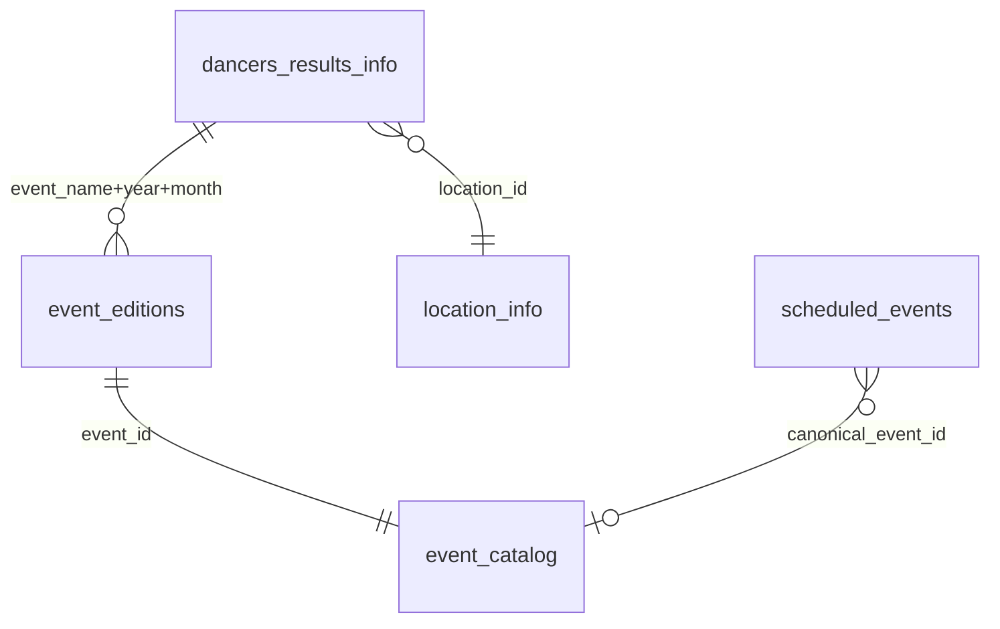

# Tableau joins

Recommended relationships without the optional 47 MB `results_by_event.csv`.

## Core event-centric model



## Primary joins

### Results → editions

Join when you need edition location and stats:

```text
dancers_results_info.event_name     = event_editions.event_name  (or use event_id via catalog)
dancers_results_info.event_year     = event_editions.event_year
dancers_results_info.event_month    = event_editions.event_month
```

Better (if you add calculated field or blend via catalog):

```text
event_catalog.event_id = event_editions.event_id
event_editions.event_year / event_month = dancers_results_info.event_year / event_month
```

Note: `dancers_results_info` lacks `event_id` in CSV — use `event_catalog.canonical_name` = `event_editions.event_name` or denormalized optional export.

### Editions → catalog

```text
event_editions.event_id = event_catalog.event_id
```

### Results → location

```text
dancers_results_info.location_id = location_info.location_id
```

### Schedule → catalog

```text
scheduled_events.canonical_event_id = event_catalog.event_id
```

Or by name (weaker):

```text
scheduled_events.canonical_name = event_catalog.canonical_name
```

## Points and roles

```text
dancers_points_info.dancer_id = dancer_role_info.dancer_id
dancers_results_info.dancer_id = dancer_role_info.dancer_id
```

## Change history

Trend charts from `changed_*` files:

```text
changed_dancer_points_info.dancer_id = dancers_points_info.dancer_id
changed_dancer_role_info.dancer_id = dancer_role_info.dancer_id   -- division changes only
changed_dancer_name_info.dancer_id = dancer_role_info.dancer_id   -- name history
(same role, dance, level for point-in-time points comparison)
```

For display name on a **past result**:

1. **Easiest:** `dancers_results_with_name.csv` (`python export.py --include-results-with-name`)
2. **Manual join:** `changed_dancer_name_info` on `dancer_id` where `update_date <= COALESCE(event_year_and_month, make_date(event_year, event_month, 1))` — pick the latest matching row per result

Do not infer renames from `changed_dancer_role_info` — that file tracks **division** changes only since migration 021.

Remember: `changed_*` rows are **versions** (one row per change), not weekly full snapshots.

## Geo-event dimension (optional)

When `export.geo_events` is exported or queried:

```text
event_catalog.event_id = geo_events.event_id
```

Use `geo_event_key` to distinguish same-name events in different cities (Worlds UCWDC Dallas vs Orlando).

See [../architecture/identity-model.md](../architecture/identity-model.md).

## Registry listing

```text
events_wsdc.id = event_catalog.event_id
```

`events_wsdc` is historical instance listing; `event_catalog` is analytics summary.

## Anti-patterns

- Joining `scheduled_events.event_name` directly to `dancers_results_info.event_name` after rebrands — use `canonical_event_id` / aliases
- Treating `changed_*` as current snapshot — use `dancers_*` for current state
- Assuming one `event_name` = one city — check geo policy for split brands

## Related

- [csv-contract.md](csv-contract.md)
- [dashboards-migration.md](dashboards-migration.md)
