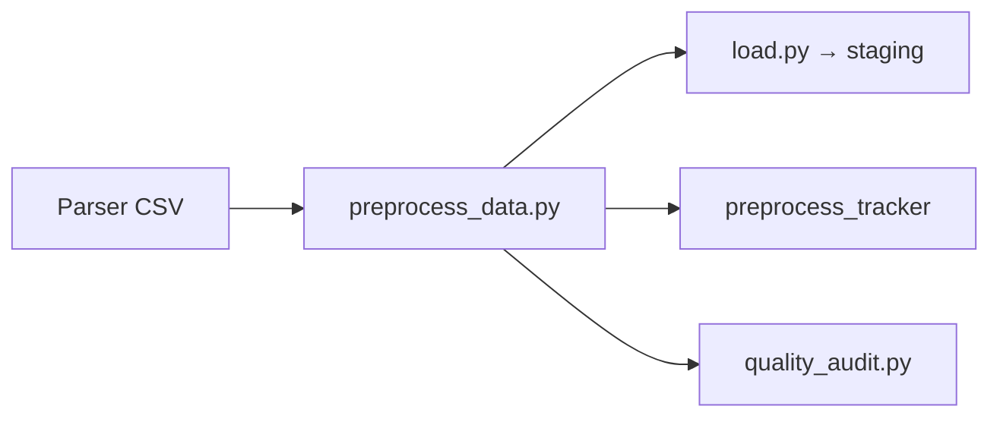

# Transform layer

Python modules under `transform/` normalize parser CSVs before load and encode business rules as knowledge maps.

## Pipeline position

## Entry point

`scripts/preprocess_data.py` → `transform/preprocess_with_log.py`

Stages (in order):

1. Load CSVs from `--data-dir`
2. Apply geography corrections (`transform/geography/`, `transform/knowledge/locations.py`)
3. Normalize roles, divisions, event names, dates
4. Run quality audit → `data/quality_reports/latest.json`
5. Write cleaned CSVs back to `--data-dir`

Always run before load when CSVs come from cloud parse.

## Module map

| Module | Role |
|--------|------|
| `preprocess_with_log.py` | Orchestration, tracked changes |
| `preprocess_tracker.py` | Rule application logging |
| `quality_audit.py` | Defect detection codes |
| `normalize.py` | Roles, levels/divisions |
| `data_preprocessing.py` | Legacy maps (deprecated entry; prefer preprocess script) |
| `geography/` | Location resolve, geo_key, metro clusters |
| `knowledge/` | Event aliases, location corrections |
| `event_knowledge.py` | Known event metadata (URL, typical location) |
| `events_list_*.py` | Schedule scrape normalization and mapping |

## Quality report structure

`data/quality_reports/latest.json`:

| Section | Meaning |
|---------|---------|
| `before_processing` | Raw defects |
| `applied_normalizations` | Rules that ran (with row counts) |
| `manual_review_required` | Open issues; `"is_new": true` needs decision |

See [../operations/quality-monitoring.md](../operations/quality-monitoring.md).

## Knowledge vs code

| Change type | Where to edit |
|-------------|---------------|
| Event name alias | `transform/knowledge/event_aliases.py` |
| Location id fix | `transform/knowledge/locations.py` |
| Schedule → catalog name | `parser/event_name_matcher.py` |
| Division spelling | `transform/normalize.py` LEVEL_ALIASES |
| Geo merge policy | `transform/geography/geo_event.py`, policies |

After map changes: rerun preprocess, load, export, and relevant tests.

## Related docs

- [divisions-levels.md](divisions-levels.md)
- [geography.md](geography.md)
- [event-names.md](event-names.md)
- [events-list.md](events-list.md)
